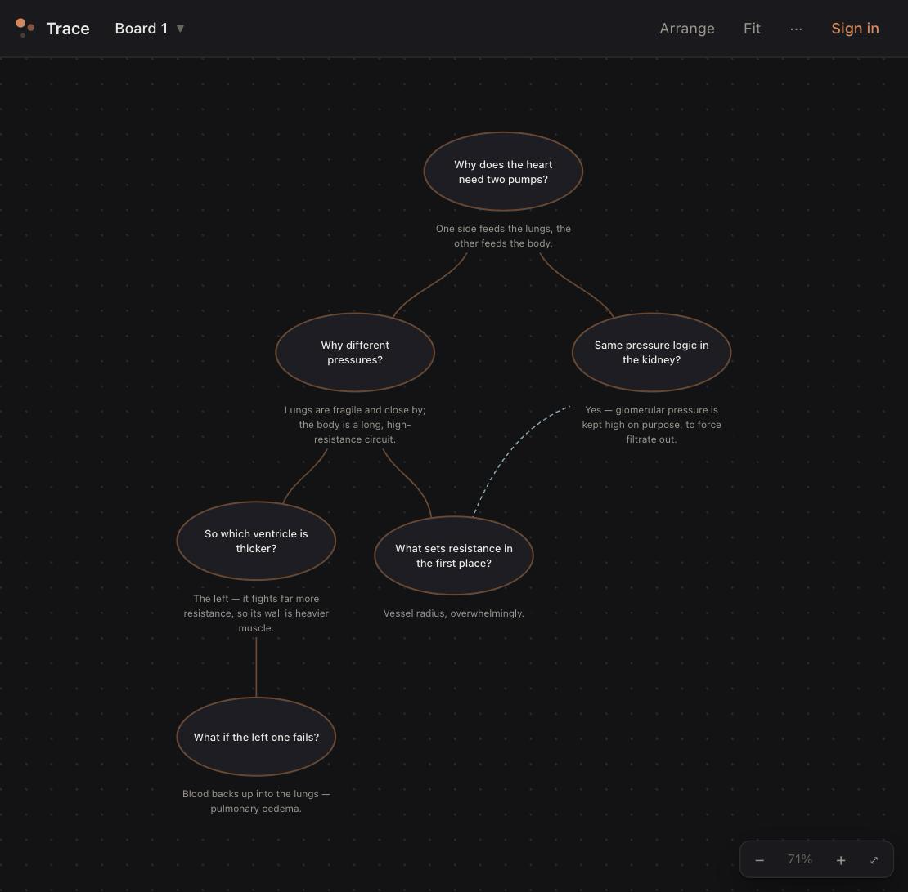

# Trace

A canvas for studying by chaining questions.

You learn something by asking a question, answering it, and letting that answer
provoke the next question. Trace is a place to write that chain down and see its
shape.



## Using it

Click anywhere on the canvas. A bubble appears there with the cursor already in
it — type your question, press `⏎`, type the answer underneath. Click empty space
again and the next bubble wires itself to the last one you touched.

- **New chain** (or `Esc`) drops the thread, so the next bubble starts a
  separate chain on the same board. Every chain gets its own colour, and
  **Arrange** gives each one its own column.
- **Branch** — click an older bubble first, then click empty space; the new one
  hangs off *that* one. Clicking any bubble picks its chain back up.
- **Shift-click** empty space for a one-off bubble with no line.
- **⤳** on a selected bubble draws a line to any other bubble — for when two
  branches turn out to be the same idea.
- **×** deletes. Drag the rim to move it.
- **Arrange** lays the whole tree out tidily. **Fit** frames everything.
- **⌘Z / ⌘⇧Z** undo and redo, coalesced so one undo takes a whole thought rather
  than one keystroke.
- **Boards** (next to the logo) keep separate topics apart — each has its own
  canvas and its own undo history.

Nothing is required to run it: open `index.html` and everything saves in your
browser.

## Optional: sync across devices

With a free Supabase project you can sign in by email — no password, it mails you
a link — and your boards follow you to any device. It stays offline-first: the
browser copy is the working copy and uploads when you reconnect.

See [SETUP.md](SETUP.md). About ten minutes.

`config.js` holds the two values that turn it on. Both are safe in public — the
anon key only works through the row-level-security rules in `schema.sql`, which
limit every request to the signed-in user's own boards. Your notes live in your
database, never in this repository.

## Layout

```
index.html    the whole app — no build step, no dependencies
config.js     your Supabase URL + anon key (blank by default)
schema.sql    the boards table and its security rules
SETUP.md      how to turn on sync
versions/     earlier builds, kept for reference
```

## Licence

MIT
